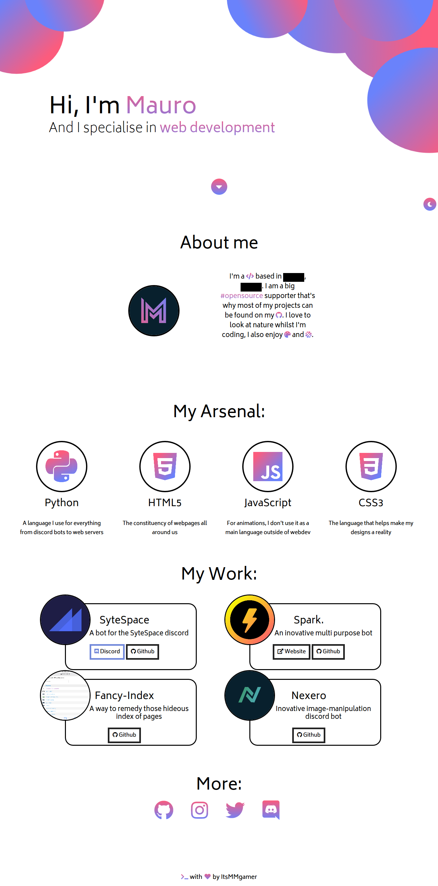

# My Personal Website

## Statistics

| Name          | Value                                                                                                                                                                                                                                                                         |
|---------------|-------------------------------------------------------------------------------------------------------------------------------------------------------------------------------------------------------------------------------------------------------------------------------|
| Lines of code | 878                                                                                                                                                                                                                                                                           |
| Code Quality  |  |
| License       |                                                                                                                                                              |

## Langauges used

HTML, CSS and JS (jQuery)

## Acknowledgements
* jQuery: https://jquery.com/
* Typed.js: https://github.com/mattboldt/typed.js/
* Inspiration: https://codepen.io/conmarap/pen/mVMvVv
* Custom Buttons: https://codepen.io/melnik909/pen/pQEazE 

